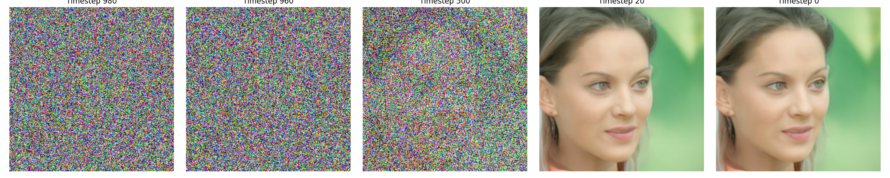

# Diffusion Models Image Generation


This repository demonstrates how to implement and train diffusion models for image generation, using CelebA as a reference dataset. It includes custom UNet and diffusion model implementations, configurations, training scripts, experiments, and supporting documentation.

<p align="center">
  
</p>

---

## Project Structure

- **configs**  
  Contains YAML configuration files defining hyperparameters and other settings for training and generation. You can easily adjust parameters like image size, number of timesteps, learning rate, batch size, and more.

- **data**  
  *(Not included in this repository)* — contains datasets and related CSV files. For CelebA, partition and attribute files are placed here.  
  - **processed**: Stores preprocessed `.npy` image files ready for training.  
  - **raw**: Holds the original, unprocessed images.  
  You can find the CelebA dataset on [Kaggle](https://www.kaggle.com/datasets/jessicali9530/celeba-dataset).

- **documentation**  
  Contains research papers and references used to understand the theoretical background of diffusion models, UNet architectures, and related deep learning concepts.

- **experiments**  
  A sandbox directory where smaller scale tests were performed. You’ll find:
  - A simple UNet architecture trial.
  - A minimal diffusion model trained on dummy data (random noise).  
  These experiments helped verify the training loop and data pipelines before scaling up.

- **image_gen.py**  
  A standalone script that uses Google’s pre-trained UNet and diffusion models to generate new images. Demonstrates how to load a trained model, run the reverse diffusion process, and produce high-quality synthetic images.

- **models**  
  A directory for storing trained model checkpoints, including diffusion model weights (`.pth` files) and the UNet backbone for noise prediction.

- **results**  
  Stores images, logs, and other outputs produced after running training and generation:
  - `generated_images`: Final synthesized images from the pre-trained diffusion model.  
  - `images_custom_network`: Outputs from the custom-trained diffusion models and UNets, allowing comparisons with the pre-trained versions.  

  *Note:* Results from the custom network may be less refined or realistic compared to the pre-trained model, often due to training on smaller subsets or fewer epochs. Over time, with more data, longer training, and careful tuning, these results should improve.

- **src**  
  The main codebase for the custom diffusion and UNet implementations, preprocessing, and training scripts. Key files include:
  - `diffusion.py`: Diffusion logic, forward and reverse noising steps, and sampling.
  - `unet.py`: Custom UNet architecture used for noise prediction.
  - `preprocess.py`: Preprocessing pipeline for raw images into normalized `.npy` files.
  - `train_diffusion.py`: Training script for the diffusion model.
  - `train_unet.py`: Training script for the custom UNet model.
  - `generate.py`: Script to generate images from the trained custom model.

---

## Getting Started

1. **Clone the Repository and Install Dependencies**  
   Make sure you have Python 3+ and the required libraries. Install additional dependencies (such as `accelerate`, `diffusers`, `torch`, `numpy`, etc.) as indicated in `requirements.txt`.

   ```bash
   git clone https://github.com/n-pizzetta/diffusion_model.git
   cd diffusion_model

   # Create and activate a virtual environment (recommended)
   python -m venv .venv
   source .venv/bin/activate  # For Linux/Mac
   # or .venv\Scripts\activate  # For Windows

   # Install both production and dev requirements via Make
   make install
   ```

2. **Prepare Data**  
   Place your raw images in `data/raw` (e.g., `data/raw/celeba`) along with the partition file (`list_eval_partition.csv`) in `data/`. Then run:

   ```bash
   python -m src.preprocess
   ```

   **Script Arguments** for `preprocess.py`:
   - `--n_images` (int): Number of images to preprocess (default=1000)  
   - `--data_type` (str): Data type: `train`, `val`, or `test` (default="train")  
   - `--csv_path` (str): Path to CelebA partitioning file (default="data/list_eval_partition.csv")  
   - `--img_size` (int): Image size (default is `64`)  
   - `--input_dir` (str): Directory containing raw images (default="data/raw/celeba")  
   - `--output_dir` (str): Directory to save processed images (default="data/processed/celeba_64")  

   **Example usage**:
   ```bash
   python -m src.preprocess \
       --n_images 2000 \
       --data_type train \
       --csv_path data/list_eval_partition.csv \
       --img_size 128 \
       --input_dir data/raw/celeba \
       --output_dir data/processed/celeba_128
   ```

3. **Configure and Train**  
   Adjust hyperparameters in `configs/config.yaml` if desired. Then, from `src`, run either `train_diffusion.py` or `train_unet.py`. For example:

   ```bash
   python -m src.train_diffusion
   ```

   **Script Arguments** for `train_diffusion.py`:
   - `--batch_size` (int): Batch size for training (default set by `8`)  
   - `--img_size` (int): Image size (default set by `64`)  
   - `--epochs` (int): Number of epochs (default set by `50`)  
   - `--learning_rate` (float): Learning rate (default set by `0.0001`)  
   - `--model_save_dir` (str): Directory to save model checkpoints (default is "models")  
   - `--num_workers` (int): Number of DataLoader workers (default set by `4`)  
   - `--timesteps` (int): Number of diffusion timesteps (default set by `500`)  
   - `--device` (str): Device to train on (e.g. `cpu` or `cuda`; default is "cpu")  

   **Example usage**:
   ```bash
   python -m src.train_diffusion \
       --batch_size 32 \
       --img_size 128 \
       --epochs 50 \
       --learning_rate 0.0002 \
       --model_save_dir models/diffusion_128 \
       --num_workers 4 \
       --timesteps 1000 \
       --device cuda
   ```

4. **Generate Images**  
   Once training is complete and model weights are in `models/`, use `generate.py` to generate images from your custom diffusion model. For the Google pre-trained diffusion model and UNet, check `image_gen.py` (models available on [Hugging Face](https://huggingface.co/google/ddpm-celebahq-256)).

   ```bash
   python -m src.generate
   ```

   **Script Arguments** for `generate.py`:
   - `--img_size` (int): Image size (default from `64`)  
   - `--model_dir` (str): Directory containing the trained model (default="models")  
   - `--output_dir` (str): Directory to save generated images (default="results/images_custom_network")  
   - `--timesteps` (int): Number of diffusion timesteps (default=`500`)  
   - `--device` (str): Device (`cpu` or `cuda`) (default="cpu")  
   - `--save_interval` (int): Interval for saving images (default=50)  

   **Example usage**:
   ```bash
   python -m src.generate \
       --img_size 128 \
       --model_dir models/diffusion_128 \
       --output_dir results/generated \
       --timesteps 1000 \
       --device cuda \
       --save_interval 25
   ```

5. **Explore Results**  
   Look into `results/` to see generated images and logs. Compare different model checkpoints, hyperparameters, and scripts (like `train_unet.py` or `train_diffusion.py`) to see how image quality varies.

---

## Development & Testing

A **Makefile** is provided to simplify common tasks. Once inside your virtual environment:

- **Install Requirements**  
  ```bash
  make install
  ```
  This installs both production (`requirements.txt`) and development (`requirements_dev.txt`) dependencies.

- **Lint**  
  ```bash
  make lint
  ```
  Runs **flake8** on `src` and `tests` to check coding style and potential errors.

- **Format**  
  ```bash
  make format
  ```
  Uses **black** to auto-format code in `src` and `tests`.

- **Run Tests**  
  ```bash
  make test
  ```
  Executes **pytest** in verbose mode. This ensures your scripts (like `preprocess.py`, `train_diffusion.py`, etc.) work as expected.

- **Check Coverage**  
  ```bash
  make coverage
  ```
  Runs tests with **pytest-cov**, displaying a coverage report to see which parts of your code are exercised by tests.

---

## Generating with Google pre-trained model

To get better images generated, you can use a pre-trained model. Here it is the Google Denoising Diffusion Probabilistic Models (DDPM).
To run it simply use the following command :

```bash
python image_gen.py
```
**Script Arguments** for `image_gen.py`:
  - `--save_dir` (str): Directory to save generated images (default set by "results/generated_images")  
  - `--img_size` (int): Image size (default set by `256`)  
  - `--timesteps` (int): Number of timesteps for denoising (default set by `50`)  
  - `--noise_file` (str): Path to a noise tensor .pt file to use as starting point (default set by `None`)  

---

## Additional Notes

- The `experiments` directory is for smaller-scale or debugging tests.
- The `documentation` folder contains theoretical references ensuring alignment with established research on diffusion models.
- If the trained custom model outputs lower-quality images compared to the Google pre-trained version, you may need more data, more epochs, or further hyperparameter tuning.

This repository serves as a comprehensive starting point for anyone looking to understand and implement diffusion models for image synthesis — from raw data preprocessing to final image generation.

**Happy coding!**